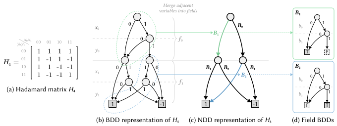

## About

**Network Decision Diagram (NDD)** is a new decision diagram, built on the classical [Binary Decision Diagram (BDD)](https://en.wikipedia.org/wiki/Binary_decision_diagram).
For BDD, each node looks at a single **bit** each time, and branches based on whether the bit is true or false;
in contrast, each NDD node looks at a **field** consisting of a fixed number of bits each time, and branches based on the value of the field.
As a result, there can be more than 2 branches for each NDD node. 

Different from the multi-valued decision diagram (MDD), where the branching conditions are **concrete**, i.e., a specific field should take a concrete value, the branching conditions in NDD are **symbolic**, i.e., a specific field can take any value of a set. 
The branching conditions are compactly encoded with **external data structures**, including but not limited to BDDs.
Currently, our NDD library supports several external data structures, including: BDD, complemented-edge BDD (BCDD), and zero-suppressed decision diagrams (ZDD).
In this sense, NDD can be seen as wrapping a lower-level decision diagram with an outer field-aware layer, and therefore the name of NDD can also be interpreted as "Nested Decision Diagram".

**An example of NDD** In this figure, we represent Hadamard matrix _H_<sub>4</sub>'s values on each coordinate (_x_<sub>0</sub>_x_<sub>1</sub>, _y_<sub>0</sub>_y_<sub>1</sub>) as a BDD (in (b)) and an NDD (in (c)). Each NDD node represents a 2-bit field (_f_<sub>1</sub> and _f_<sub>2</sub>), and the branching condition is encoded with 2 BDDs (in (d)).



## Benchmark

The following table shows the benchmark for **N-Queens** with N=12 and N=13.

| Implementation | Language | N=12 time (s) | N=13 time (s) |
| --- | --- | ---: | ---: |
| BuDDy | C | 41.098 | >500 |
| CUDD | C | 28.663 | 194.928 |
| JDD | Java | 19.011 | 148.970 |
| DD-BDD | C# | 13.931 | 81.584 |
| DD-CBDD | C# | 9.730 | 55.487 |
| **NDD** | **Java** | **3.439** | **23.662** |

For more details, please refer to [N-Queens Benchmark](https://github.com/XJTU-NetVerify/NDD/wiki/Results-NQueens). 

## How to use


### NDD Label Backends

NDD supports both homogeneous and mixed label backends: each field may select BDD, BCDD, or
set-family ZDD labels. Every width-`w` field has the same Boolean domain of `2^w` bit vectors,
independent of its backend. Fields of the same type share one backend engine and right-aligned
variable layout. See the [Usage](https://github.com/XJTU-NetVerify/NDD/wiki/Usage) and
[Design Notes](https://github.com/XJTU-NetVerify/NDD/wiki/Design-Notes) pages for details.

The former finite-domain ZDD experiment used a different, one-of-`w` domain and has been retired.
Its archived N-Queens measurements are identified as legacy data in
[`results/nqueens_backend_results.md`](results/nqueens_backend_results.md); they are not results for
the current `ZDD` backend.

## APIs

The NDD library provides offers the following APIs.

- `apply()`: apply a logical operation on two NDDs,
- `simplify()`: 
- `restrict()`: fix a field value and obtain its cofactor
- `satCount()`, `anySat`, `allSat`: count the number of satisfiable assignments
- `exist()`: existential quantification over one or more fields: 
- `substitute()`: 

Refer to the [API guide](https://github.com/XJTU-NetVerify/NDD/wiki/Manipulation-APIs) for more details. 

## The Origin of NDD

NDD was originally proposed for network verification, where each NDD node represents a packet header field (destination IP address)
We observed NDD was more efficient than BDD in terms of memory and computation.
The reason is due to the **locality** of field-based matching semantics, NDD can significantly reduce the number of nodes.

## Ongoing Work

The current NDD libary is by far not the end, and we are working on extending it to support: (1) multiple terminals, (2) parallel computation, (3) using NDD for more applications like modeling checking.

## Branches

* Main: Featuring an efficient design of node table.
* Reuse: Featuring the reuse of label decision-diagram variables among all fields.
* Original: The original prototype for NSDI '25 paper.

## Resources

- [wiki](https://github.com/XJTU-NetVerify/NDD/wiki)
- [NSDI Paper](https://www.usenix.org/system/files/nsdi25-li-zechun.pdf)
- [NSDI talk slides](https://xjtu-netverify.github.io/papers/NDD/NDD-A-Decision-Diagram-for-Network-Verification.pdf)
- [NSDI talk video](https://www.youtube.com/watch?v=9Ni6Z7qKGV4)

## Bibtex

```bibtex
@inproceedings{NDD,
  title={NDD: A Decision Diagram for Network Verification},
  author={Li, Zechun and Zhang, Peng and Zhang, Yichi and Yang, Hongkun},
  booktitle={22nd USENIX Symposium on Networked Systems Design and Implementation (NSDI 25)},
  pages={237--258},
  year={2025}
}
```

### Contact

- Peng Zhang (p-zhang@xjtu.edu.cn)
- Yichi Zhang (augists@outlook.com)
- Zechun Li (1467874668@qq.com)

## License

Apache-2.0. See [`LICENSE`](LICENSE).
